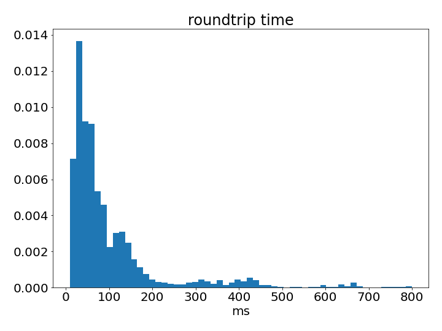
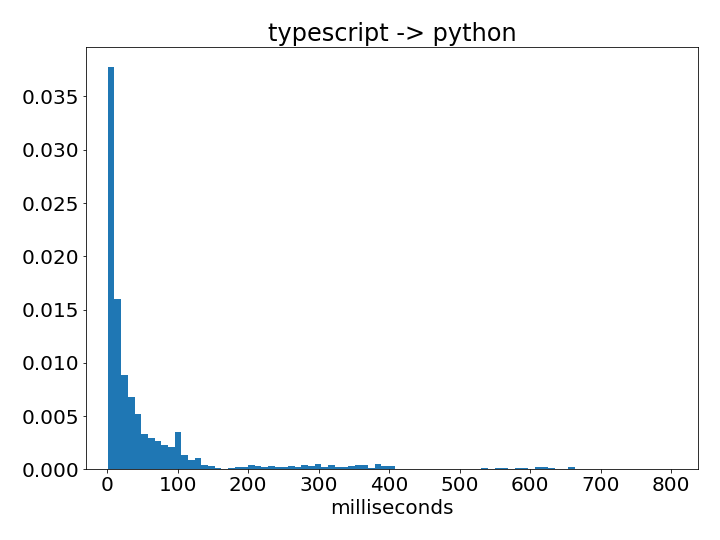
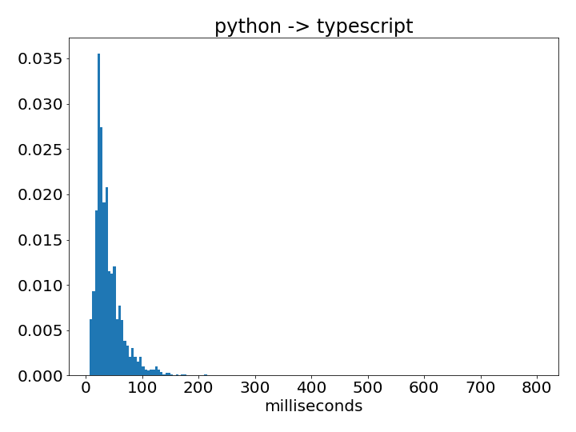
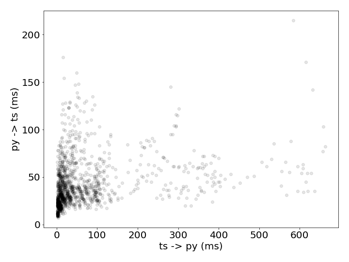

# widget_message_speed
## What
A jupyter widget to test how long it takes messages generated by user interactions to move between typescript and python.

I should note that as far as I know the widget documentation never claimed that these messages would be low latency. Also, I view widgets as a magical gift that finally enabled me to easily make user interactions for scientific python that don't look like they are from the mid-90s. I love what they enable and don't mean this as a bad thing about widgets just a probing of what the limits are.

## Why
I made a manual image segmentation tool using the matplotlib lasso tool but found that it was not responsive enough to be a pleasant experience to use in the notebook ([video](https://www.youtube.com/watch?time_continue=1&v=aYb17GueVcU&feature=emb_logo) - [implementation (code)](https://github.com/ianhi/AC295-final-project-JWI/blob/master/lib/labelling.py)) so I considered using [ipycanvas](https://ipycanvas.readthedocs.io/en/latest/) but was [advised](https://gitter.im/QuantStack/Lobby?at=5ece11eb27513a72fbb63020) that it would be a better experience to implement the user interaction in typescript - which I'm doing with [ipysegment](https://github.com/ianhi/ipysegment). But I was still curious what the actual timings are so I made this. I think the results here back up the idea that python callbacks to jupyter widgets have too much latency for implementing real time user interactions via python. 


## Method
 All timings were measured in the notebook in the examples directory. The steps were:
1. A `mousemove` event on the widget is triggered
   - Start time is recorded
   - message sent to python side
2. On receiving message python records the time and sends a message back
   - `ts_py_time` gets calculated (`t2-t1`)
3. typescript receives the message and records the time
   - `py_ts_time` gets calculated (`t3-t2`)
   - `ts_roundtrip` calculated (`t1-t3`)
       - this time has always been the same as py_ts_time + ts_py_time to ms precision
I think that this measurement is basically a best case scenario for speed becase both the typescript even handling and the python message handling are as close to no-ops as possible.

If anyone ever reads this and can think of a better methodology please feel free to open an issue - I'd love to hear your thoughts!

## Results
Below are some plots from me moving the mouse slowly but consistently over the widget on my laptop. If I move the mouse much faster and do so for more events I end up getting groups of larger outliers (~4000 ms). All plots were generated with `plt.hist(...., density=True)` so the `y` axis is a probability. At no point did I run into the `iopub_msg_rate_limt` which seems to default to 1000 msgs/s so any long message times are likely not the result of that.





## Installation
Make sure you have nodejs in your environment

```bash
#conda setup if you want such a thing
conda create -n msg-speed -c conda-forge jupyterlab nodejs matplotlib
conda activate msg-speed
```

```bash
pip install -e .

jupyter labextension install @jupyter-widgets/jupyterlab-manager --no-build
jupyter labextension install .
```


To make changes:
```bash
npm run watch

# in another terminal
jupyter lab --watch
```

if you make typescript changes wait for them to rebuild then refresh the page. If you make changes to the python restart the notebook's kernel and the changes should apply.